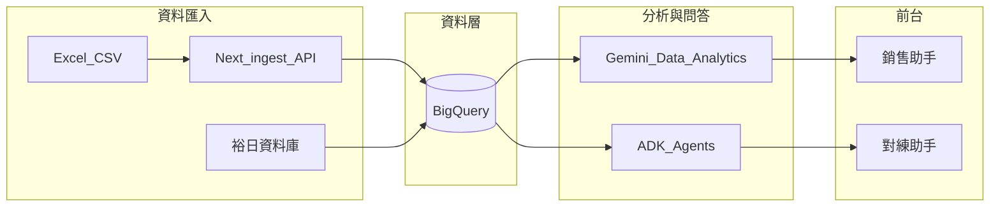

# BigQuery × Gemini Data Analytics 資料路徑（技術定案草案）

本文件說明 PoC 階段已驗證的 **「以 BigQuery 為資料源、以 Gemini Data Analytics 能力做自然語言查詢／分析」** 路徑，取代早期「Vertex AI Search 是否可直接以 BQ 表為索引源」的不確定性。

## 架構摘要

| 層級 | 角色 | 說明 |
|------|------|------|
| 資料層 | **BigQuery** | 話術、專家、詢問／對練紀錄、統計彙總等結構化主資料；由 Excel／裕日 DB／平台寫入。 |
| 分析層 | **Gemini Data Analytics**（含 Gemini in BigQuery、自然語言查表／分析 API） | 以 BQ 表為資料源進行語意搜尋、SQL 生成、貢獻分析等，**不需另建 Vertex Search 專用索引同步層**。 |
| 應用層 | Next 平台 + ADK Agent | 總部資料整理、銷售助手、對練助手；Agent 可透過 API 呼叫 Gemini 分析結果或直接查 BQ。 |

## 相對於舊方案的突破

早期風險（見 [`PROJECT_SCOPE_SALES_TRAINING.md`](./PROJECT_SCOPE_SALES_TRAINING.md) 舊版 3.4）主要卡在：

- Vertex AI Search and Conversation **未必**原生以 BQ 表為「可檢索文件源」
- 是否需經 **Cloud Storage** 或額外向量索引層

**現行結論（PoC）**：

1. **資料先進 BQ**（staging → 正式表／檢視），欄位契約由 [`script-drills-contract.ts`](../src/lib/ingest/script-drills-contract.ts) 與 DDL 凍結。
2. **問答與查找**改走 **Gemini Data Analytics API**（或 Gemini in BigQuery 同等能力），直接對已授權的 dataset／表做自然語言查詢與分析。
3. **Vertex Search** 降為非主路徑；若特定場景需獨立文件檢索再個案評估。

## 實作對照（本 repo）

| 能力 | 狀態 | 位置 |
|------|------|------|
| Excel → BQ staging | 已實作 | [`/api/ingest/script-drills`](../app/api/ingest/script-drills/route.ts)、[`BQ_INGEST_POC.md`](./BQ_INGEST_POC.md) |
| BQ 寫入程式 | 已實作 | [`src/lib/bq/`](../src/lib/bq/) |
| Gemini Data Analytics 串接 | 待實作 | 建議新增 `src/lib/gemini/` + 銷售助手 API |
| 總部資料整理平台 | 已實作（試用） | `web/app/(app)/` 各模組 |

## 待驗收（非法遵類）

- 代表業務問句在 BQ 上的 **召回率／正確率**（話術、競品、車型欄位）。
- 延遲與 **配額**（Gemini API、BQ 掃描成本）。
- 服務帳號 **最小權限**（dataset 級 IAM）。
- 脫敏欄位是否進入可查詢表（與法務共識）。

## 參考（Google Cloud）

- [Gemini in BigQuery overview](https://cloud.google.com/bigquery/docs/gemini-overview)
- [Analyze data with Gemini assistance](https://cloud.google.com/bigquery/docs/gemini-analyze-data)
- [BigQuery data analytics（Gemini CLI extension）](https://github.com/gemini-cli-extensions/bigquery-data-analytics)
