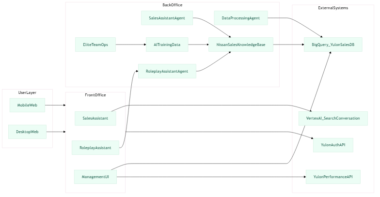
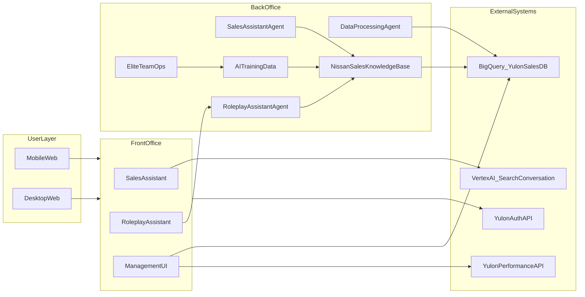
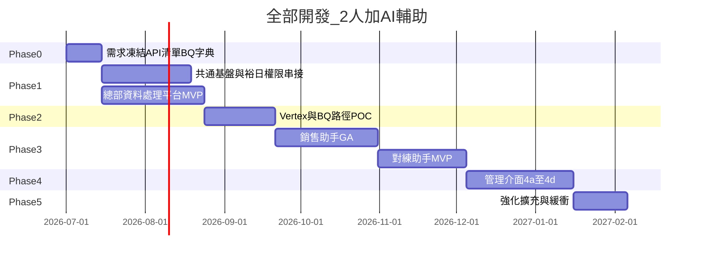
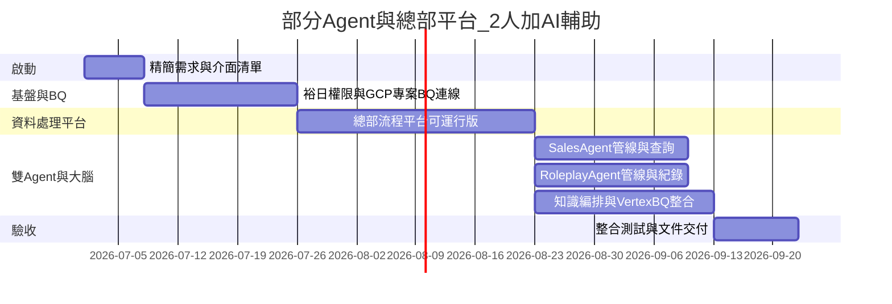

# 銷售顧問智慧訓練系統 — 專案範疇與開發項目

| 項目 | 說明 |
|------|------|
| 文件名稱 | 銷售顧問智慧訓練系統 — 專案範疇與開發項目 |
| 版本 | 草案 v0.2（精簡版） |
| 適用對象 | 裕日總部智慧行銷部、資訊、法務、業務、外部供應商 |
| 平台入口 | **手機瀏覽器**與**桌面網頁**皆可登入（響應式 Web；【待確認】是否另做原生 App） |
| 權限機制 | **串接裕日系統 API**；【待確認】規格、錯誤碼、快取策略由裕日提供 |

---

## 1. 系統架構圖（本案重要依據）

圖檔請依 [`images/README.md`](images/README.md) 放入同目錄：

**四大功能對應（摘要）**：USER 情境（多裝置、有望客編號等）→ 前台（銷售助手、對練助手、管理介面）→ 後台（資料處理 Agent、雙 Agent、知識庫、訓練資料、菁英團隊 PDCA）。

---

## 2. 專案願景與範疇邊界

**願景**：以 AI 協助 Nissan 銷售顧問在實戰與對練中提升應對能力，並由總部流程與知識庫持續 PDCA。

**範疇內**：總部資料處理／流程平台；銷售助手與對練助手（含資料源與 AI）；管理介面（統計、戰力儀表板、權限維護、Top50）；跨端 Web 與裕日權限 API。

**範疇外（建議後續）**：原生 App（除非納標）；第三方 CRM 深度客製；影片對練評分。

---

## 3. 四大功能（精要）

### 3.1 功能一：資料處理 AI Agent／平台（總部智慧行銷部）

內部營運：問句／專家回饋／LLM／行銷審核／法務／回寫主庫等；與知識庫／BQ 之寫入或匯出介面 【待確認】單雙向、頻率、主資料歸屬。

### 3.2 功能二：銷售助手（前台）

顧問發問 → AI 依知識庫回覆。資料：【待確認】 **BigQuery** 為主；AI：【待確認】 **Vertex AI Search and Conversation**（或等價）以 BQ 表為或接近「資料源」之可行性（索引路徑、是否需經 GCS／同步層）。

架構決策：【待確認】「以 BQ 為唯一真實來源（SoT）」與「Vertex 產品原生支援度」可二擇一或混合；**先 POC 驗證索引路徑，再凍結架構**。

### 3.3 功能三：對練助手（前台）

AI 出題 → 顧問作答 → 評分與建議；對練紀錄進 BQ。【待確認】「格上小格學長」對照規格（流程、評分、欄位）取得時程與範圍。

### 3.4 功能四：管理介面

| 子項 | 說明 | 資料來源 |
|------|------|----------|
| 4a 使用統計 | PV/UV、對話數等 | log → BQ 或既有平台 |
| 4b 戰力儀表板 | 訓練與業績連動 | 【待確認】 **裕日業績系統 API** ＋訓練事件 |
| 4c 權限／維護 | 比照裕日系統 | 【待確認】 **裕日權限 API** |
| 4d Top50 | 競品相關詢問統計 | BQ 聚合＋排程規則 【待確認】 |

---

## 4. 風險

| 風險 | 說明與處置方向 |
|------|----------------|
| Vertex＋BQ | 【待確認】原生索引路徑；未過則替代架構與 POC 報告後再定案。 |
| 【待確認】裕日權限 API／業績 API | 規格、sandbox、到齊日；延遲則 4b／4c 改暫行方案並變更紀錄。 |
| 對練產品深度 | 無「小格學長」程式碼，需訪談還原，避免範圍蔓延。 |
| 個資／法遵 | 有望客編號、對話進 BQ 【待確認】；Top50 排除規則與正規化 【待確認】。 |
| 人力與並行 | 2 人（約 4～5 年資歷）＋ AI 輔助可加速產碼；**無法**壓縮裕日／GCP／法遵之等待日曆。 |

**Vertex POC 驗收（精簡）**：代表問句可用率、BQ→服務路徑書面說明、替代方案、脫敏與資安檢核。

**BQ 草案（精簡）**：詢問紀錄、對練回合、埋點事件、Top50 聚合邏輯—欄位與法遵須與裕日 DBA／法務 【待確認】 定稿。

---

## 5. 專案時程

**假設**：2 名後端／全端（約 4～5 年經驗）＋ AI 工具輔助；甘特起始日 `2026-07-01` 為示意，開案後整體平移。

### 5.1 全部開發（前台雙模組、總部資料處理、完整管理介面、Vertex＋BQ、業績／權限 API 等）

| 方案 | 總曆時（建議區間） | 範圍摘要 |
|------|-------------------|----------|
| **全部開發** | **約 7～9 個月**（約 28～38 週） | 四大功能＋整合驗收；外部節奏若極順可另議挑戰週數（須列前提）。 |

### 5.2 部分 Agent 開發（總部資料處理平台＋大腦／管線＋雙 Agent 與 BQ；不含完整第一線 UI 與完整管理介面 4a～4d）

| 方案 | 總曆時（建議區間） | 範圍摘要 |
|------|-------------------|----------|
| **部分 Agent 開發** | **約 12～16 週**（約 3～3.5 個月） | 總部平台＋雙 Agent API／管線與 BQ；第一線與管理儀表板可後續疊代。 |

### 5.3 兩案對照（僅時程與範圍）

| 項目 | 全部開發 | 部分 Agent 開發 |
|------|----------|-----------------|
| 第一線銷售／對練 UI | 產品化納入 | 以 API／極簡驗證 UI 為主 |
| 管理介面 4a～4d | 納入 | 不納入（或另議最小 log） |
| 總曆時（上表） | 約 7～9 個月 | 約 12～16 週 |

---

## 文件與圖檔

| 類型 | 路徑 |
|------|------|
| 本文件 | `web/docs/PROJECT_SCOPE_SALES_TRAINING.md` |
| 架構圖 | `web/docs/images/sales-consultant-intelligent-training-architecture.png`（見 [`images/README.md`](images/README.md)） |
| PDF | 於 `web` 執行 `npm run docs:pdf` 產生 `PROJECT_SCOPE_SALES_TRAINING.pdf` |
