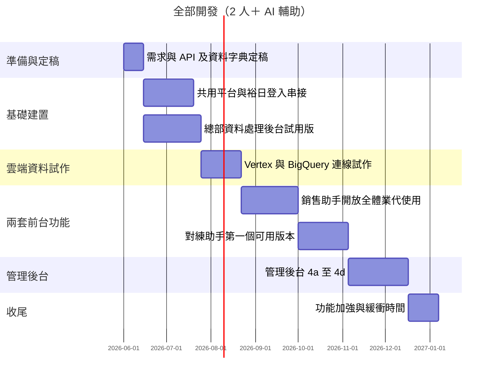
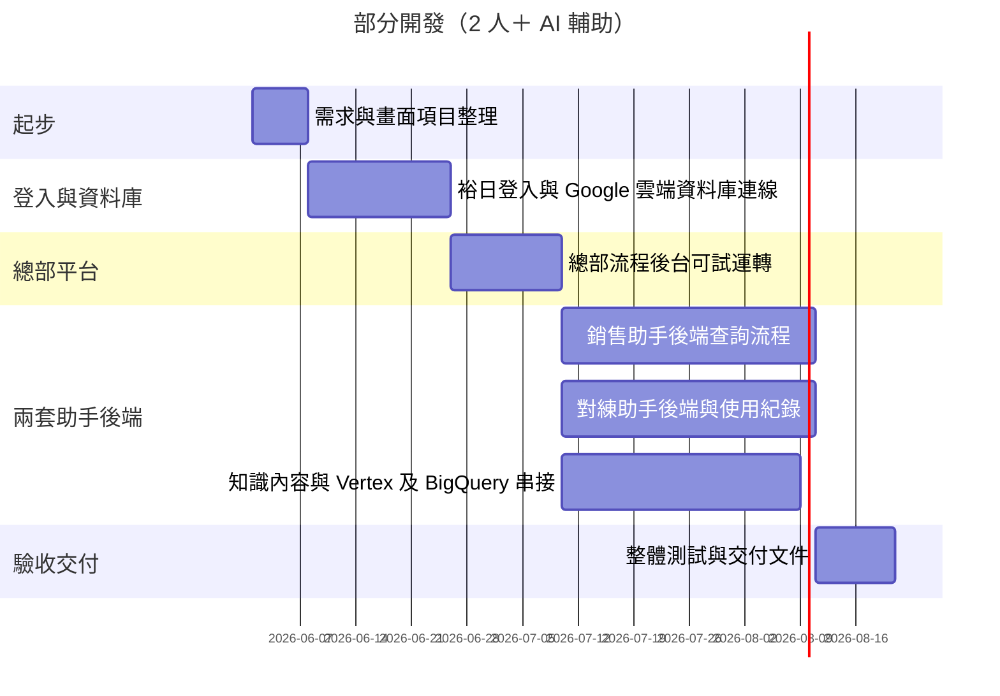

# 銷售顧問智慧訓練系統 — 專案範疇與開發項目

| 項目 | 說明 |
|------|------|
| 文件名稱 | 銷售顧問智慧訓練系統 — 專案範疇與開發項目 |
| 版本 | 草案 v0.7（精簡版） |
| 適用對象 | 裕日總部智慧行銷部、資訊、法務、業務、外部供應商 |
| 平台入口 | **手機瀏覽器**與**桌面網頁**皆可登入（響應式 Web） |
| 權限機制 | **串接裕日系統 API**；規格、錯誤碼、快取策略由裕日提供 |

---

## 1. 專案願景與範疇邊界

**願景**：以 AI 協助 Nissan 銷售顧問在實戰與對練中提升應對能力，並由總部流程與知識庫持續 PDCA。

**範疇內**：總部資料處理／流程平台；銷售助手與對練助手（含資料源與 AI）；管理介面（統計、戰力儀表板、權限維護、Top50）；跨端 Web 與裕日權限 API。

**範疇外（建議後續）**：原生 App（除非納標）；第三方 CRM 深度客製；影片對練評分。

**系統架構圖**

## 2. 四大功能

**四大功能對應（摘要）**：

- USER 情境：多裝置、有望客編號等
- 前台：銷售助手、對練助手、管理介面
- 後台：資料處理 Agent、雙 Agent、知識庫、訓練資料、菁英團隊 PDCA

### 2.1 功能一：資料處理 AI Agent／平台（總部智慧行銷部）

- **內部營運**：問句、專家回饋、LLM、行銷審核、法務、回寫主庫等流程與責任分工
- **資料介面**：與知識庫／BigQuery 之寫入或匯出介面

### 2.2 功能二：銷售助手（前台）

- **使用流程**：業代發問 → AI 依知識庫回覆
- **資料層**：BigQuery 與相關資料管線
- **AI 服務**：Vertex AI Search and Conversation（或等價方案）與 BQ／知識庫整合
- **架構原則**：先以試作驗證 BigQuery 與 Vertex 之索引與資料路徑，再定稿整體架構

### 2.3 功能三：對練助手（前台）

- **使用流程**：AI 出題 → 業代作答 → 評分與建議；對練紀錄進 BigQuery
- **規格對照**：對齊「格上小格學長」之流程、評分與欄位（訪談與文件還原）

### 2.4 功能四：管理介面

- **4a 使用統計（對內）**：對象為內部人員檢視系統使用情形；**不以網站流量（瀏覽次數／不重複訪客）為主**，而著重 **業代是否實際使用銷售助手、對練助手等 AI 協助功能**、使用頻率與模組分布，以及與 **業績或成交行為** 是否可合理對照（指標與定義於「3. 風險」釐清）。資料來源為系統紀錄（log）→ BigQuery 或既有內部分析平台。
- **4b 戰力儀表板**：呈現訓練與業績之連動。資料來源為裕日業績系統 API 與訓練事件。
- **4c 權限／維護**：帳號與權限維運比照裕日系統。資料來源為裕日權限 API。
- **4d Top50**：競品相關詢問之統計。資料來源為 BigQuery 彙總與排程規則。

---

## 3. 風險

以下為須由裕日、法遵或技術驗證釐清之項目；文中其他章節不再重複標註【待確認】。

### 3.1 產品與平台

- 【待確認】是否另做原生 App（目前假設以響應式 Web 為主）

### 3.2 裕日 API／介面規格

- 【待確認】權限 API 之規格、錯誤碼、快取策略與提供時程
- 【待確認】業績系統 API 之規格、測試環境、到齊日（影響 4b）
- 【待確認】權限 API 與管理介面 4c 之串接細節與對照表

### 3.3 資料流與主資料

- 【待確認】知識庫／BigQuery 寫入或匯出介面之單雙向、頻率、主資料歸屬

### 3.4 雲端 AI、架構與 Vertex＋BQ

- 【待確認】資料層是否以 BigQuery 為主及其邊界
- 【待確認】Vertex AI Search and Conversation（或等價）以 BQ 表為或接近「資料源」之可行性（索引路徑、是否需經 Cloud Storage／同步層）
- 【待確認】「以 BigQuery 為唯一主資料來源」與 Vertex 產品原生支援度之定案方式（擇一、併用或替代方案）
- 【待確認】Vertex 與 BQ 之原生索引路徑與產品邊界
- **處置**：未過驗收則提出替代架構與試作驗證報告後再定案

### 3.5 對練對照與產品深度

- 【待確認】「格上小格學長」對照規格（流程、評分、欄位）之取得時程與納入範圍
- 無「小格學長」程式碼可對照，需訪談還原
- **處置**：以訪談紀錄凍結範圍，避免範圍蔓延

### 3.6 個資與法遵

- 【待確認】有望客編號、對話內容是否進 BigQuery 及保存條件
- 【待確認】Top50 之排除規則與正規化
- **處置**：與法務／資安對齊欄位與保存政策後再實作

### 3.7 統計與儀表（含 4a、Top50）

- 【待確認】內部使用統計（4a）之指標與範圍：業代是否實際使用銷售助手與對練助手等 AI 功能、使用頻率與模組分布、與業績或成交行為之對照方式（非網站流量統計）
- 【待確認】Top50／BigQuery 彙總與排程規則之細部定義

### 3.8 跨單位定稿

- 【待確認】詢問紀錄、對練回合、埋點事件、Top50 彙總等欄位與法遵，須與裕日 DBA／法務定稿

### 3.9 人力與並行

- 2 人（約 4～5 年資歷）＋ AI 輔助可加速產碼
- **處置**：外部依賴仍以裕日／GCP／法遵之等待日曆為準，**無法**以人力單方面壓縮

**Vertex 試作驗收（精簡）**

- 代表問句可用率
- BQ→服務路徑書面說明與替代方案
- 脫敏與資安檢核結論

**BQ 草案（精簡）**

- 詢問紀錄、對練回合、埋點事件、Top50 彙總邏輯

---

## 4. 專案時程

**假設**：2 名後端／全端（約 4～5 年經驗）＋ AI 工具輔助；甘特起始日 `2026-06-01` 為示意，開案後整體平移。

### 4.1 全部開發（前台雙模組、總部資料處理、完整管理介面、Vertex＋BigQuery、業績／權限 API 等）

### 4.2 部分開發（總部平台＋兩套助手後端與 BigQuery；不含完整第一線畫面與完整管理後台 4a～4d）

