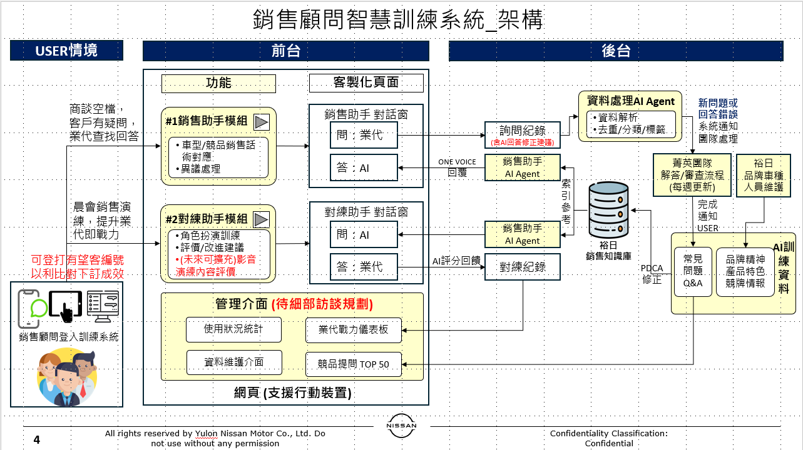

# 銷售顧問智慧訓練系統 — 專案範疇與開發項目

| 項目 | 說明 |
|------|------|
| 文件名稱 | 銷售顧問智慧訓練系統 — 專案範疇與開發項目 |
| 版本 | 草案 v0.15（BQ + Gemini Data Analytics 路徑定案） |
| 適用對象 | 裕日總部智慧行銷部、資訊、法務、業務、外部供應商 |
| 平台入口 | **手機瀏覽器**與**桌面網頁**皆可登入（響應式 Web） |
| 權限機制 | **串接裕日系統 API**；規格、錯誤碼、快取策略由裕日提供 |
| 資料與 AI 主路徑 | **BigQuery 為結構化主資料**；**Gemini Data Analytics API**（含 Gemini in BigQuery）以 BQ 為資料源做語意查詢與分析 |

---

## 1. 專案願景與範疇邊界

**願景**：以 AI 協助 Nissan 銷售顧問在實戰與對練中提升應對能力，並由總部流程與知識庫持續 PDCA。

**範疇內**：總部資料處理／流程平台；銷售助手與對練助手（含資料源與 AI）；管理介面（統計、戰力儀表板、權限維護、Top50）；跨端 Web 與裕日權限 API；**BQ 資料管線與 Gemini 分析串接**。

**範疇外（建議後續）**：原生 App（除非納標）；第三方 CRM 深度客製；影片對練評分。

**系統架構圖**



**技術路徑（文字版，與上圖互補）**：詳見 [GEMINI_BQ_DATA_PATH.md](./GEMINI_BQ_DATA_PATH.md)。

---

## 2. 四大功能

### 2.1 功能一：資料處理 AI Agent／平台（總部智慧行銷部）

- **內部營運**：問句、專家回饋、LLM、行銷審核、法務、回寫主庫等流程與責任分工
- **資料介面**：Excel／CSV／裕日 DB → **BigQuery**；欄位契約與 staging 見 [BQ_INGEST_POC.md](./BQ_INGEST_POC.md)

### 2.2 功能二：銷售助手（前台）

- **使用流程**：業代發問 → AI 依 **BQ 內話術與知識資料** 回覆
- **知識庫實作**：以 **BigQuery 表／檢視** 承載裕日銷售話術、問答與標籤；不再假設需先同步至獨立向量庫才能檢索
- **AI 服務**：**Gemini Data Analytics API**（自然語言對 BQ 查詢、分析、解讀）；必要時輔以 ADK Agent 編排
- **架構原則**：**資料進 BQ → Gemini 以 BQ 為資料源查找**；PoC 已驗證此路徑可行，取代「Vertex Search 能否直接吃 BQ 表」之不確定

### 2.3 功能三：對練助手（前台）

- **使用流程**：AI 出題 → 業代作答 → 評分與建議；對練紀錄寫入 **BigQuery**
- **規格對照**：對齊「格上小格學長」之流程、評分與欄位（訪談與文件還原）

### 2.4 功能四：管理介面

- **4a 使用統計**：業代使用銷售／對練助手之頻率與模組分布；資料來源為 log → **BigQuery**
- **4b 戰力儀表板**：訓練與業績連動；裕日業績 API + BQ 訓練事件
- **4c 權限／維護**：裕日權限 API
- **4d Top50**：競品詢問彙總；**BigQuery** 排程

---

## 3. 風險與待辦

以下仍須裕日、法遵或技術定稿；**已排除**「BQ 能否作為 AI 檢索資料源」之結構性疑慮（改走 Gemini Data Analytics）。

### 3.1 產品與平台

- 【待確認】是否另做原生 App（目前假設響應式 Web）

### 3.2 裕日 API

- 【待確認】權限 API 規格、錯誤碼、快取、時程
- 【待確認】業績 API 規格與測試環境（影響 4b）

### 3.3 資料流與主資料

- 【待確認】裕日 DB 開放範圍、更新節奏、寫入 BQ 欄位與資安
- 【待確認】知識庫內容範圍、更新節奏與總部整理平台銜接
- **已定**：結構化主資料以 **BigQuery** 為準；匯入管線見 repo PoC

### 3.4 雲端 AI 與 BQ（更新）

| 項目 | 狀態 | 說明 |
|------|------|------|
| BQ 作為主資料層 | **已定** | 話術、專家、紀錄、彙總均以表／檢視管理 |
| 以 BQ 為資料源做 AI 查找 | **已定（PoC）** | **Gemini Data Analytics API**／Gemini in BigQuery |
| Vertex AI Search 直接索引 BQ | **非主路徑** | 早期阻塞點；僅特殊文件檢索場景再評估 |
| GCS 同步層 | **非必須** | 除非非法結構化文件庫，否則不強制 |
| ADK 雙 Agent 串接 | 【待確認】 | 執行環境、版本、與 Gemini／BQ 呼叫方式 |

### 3.5 對練對照

- 【待確認】「格上小格學長」規格取得時程與範圍

### 3.6 個資與法遵

- 【待確認】有望客編號、對話內容是否進 BQ 及保存條件
- 【待確認】Top50 排除規則

### 3.7 統計與儀表

- 【待確認】4a 指標定義、Top50 彙總規則

### 3.8 跨單位定稿

- 【待確認】詢問、對練、埋點、Top50 等欄位與法遵（裕日 DBA／法務）

### 3.9 人力與並行

- 2 人 + AI 輔助；外部依賴（裕日／GCP／法遵）時程無法單靠人力壓縮

**Gemini × BQ 試作驗收（取代原 Vertex 試作）**

- 代表問句在 BQ 話術表上之可用率（正確話術／欄位召回）
- API 延遲、配額與單次查詢成本試算
- IAM 最小權限與脫敏檢核

**BQ 資料草案**

- 話術 staging／正式表、專家名單、詢問與對練紀錄、埋點、Top50 彙總邏輯

---

## 4. 專案時程

**假設**：2 名後端／全端 + AI 輔助；甘特起始日 `2026-06-01` 為示意，開案後整體平移。

### 4.1 全部開發

```mermaid
%%{init: { "gantt": { "barHeight": 44, "barGap": 14, "fontSize": 16, "sectionFontSize": 17, "topPadding": 70, "leftPadding": 200, "gridLineStartPadding": 50 } } }%%
gantt
title 全部開發（2 人＋ AI 輔助）
dateFormat YYYY-MM-DD
section 準備與定稿
需求與 API 及資料字典定稿 :p0, 2026-06-01, 14d
section 裕日資料庫與 BigQuery
裕日資料庫串接與資料匯入 BigQuery :pdb, after p0, 22d
section 基礎建置
共用平台與裕日登入基本銜接 :p1, after pdb, 12d
總部資料處理後台試用版 :p1b, after p1, 30d
section BQ 與 Gemini 分析
BigQuery 與 Gemini Data Analytics 串接試作 :pll, after p1b, 68d
section 知識庫
裕日銷售知識庫建置與內容匯入 BQ :pk, after p1b, 28d
section 兩套前台功能
銷售助手開放全體業代使用 :p3a, after pll pk, 36d
對練助手第一個可用版本 :p3b, after p3a, 32d
section 管理後台
管理後台 4a 至 4d :p4, after p3b, 36d
section 收尾
功能加強與緩衝時間 :p5, after p4, 22d
```

### 4.2 部分開發（目前主軸）

```mermaid
%%{init: { "gantt": { "barHeight": 44, "barGap": 14, "fontSize": 16, "sectionFontSize": 17, "topPadding": 70, "leftPadding": 200, "gridLineStartPadding": 50 } } }%%
gantt
title 部分開發（2 人＋ AI 輔助）
dateFormat YYYY-MM-DD
section 起步
需求與測試範圍定稿 :v0, 2026-06-01, 8d
section 裕日資料庫與 BigQuery
裕日資料庫串接與資料匯入 BigQuery :vdb, after v0, 22d
section GCP 專案進駐
裕日 GCP 專案內開發環境與權限就緒 :v1, after vdb, 8d
section 資料整理平台
資料整理 Agent 平台試運轉 :v2, after v1, 20d
section BQ 與 Gemini 分析
BigQuery 與 Gemini Data Analytics 串接試作 :vll, after v2, 64d
section 知識庫
裕日銷售知識庫建置與內容匯入 BQ :v3, after v2, 28d
section 兩個 Agent ADK
銷售助手 Agent ADK 串 BQ 與 Gemini :v4a, after vll v3, 18d
對練助手 Agent ADK 串 BQ 與 Gemini :v4b, after vll v3, 18d
section 測試驗收
問答對照知識庫與對練情境驗收 :v5, after v4a v4b, 12d
```

### 4.2.1 PoC：Excel／CSV → BigQuery staging

已實作：話術表上傳、解析、寫入 staging。詳見 [BQ_INGEST_POC.md](./BQ_INGEST_POC.md)。

**下一步（vll）**：在 BQ 表就緒後，串接 **Gemini Data Analytics API**，驗證業代自然語言問句能否正確檢索話術與欄位。

---

## 5. 相關文件

| 文件 | 用途 |
|------|------|
| [GEMINI_BQ_DATA_PATH.md](./GEMINI_BQ_DATA_PATH.md) | BQ + Gemini 技術路徑與突破說明 |
| [BQ_INGEST_POC.md](./BQ_INGEST_POC.md) | Excel 匯入 BQ API 與欄位對策 |
| [architecture-export.mmd](./architecture-export.mmd) | 架構圖 Mermaid 原始檔 |
| [EMAIL_INTEGRATION.md](./EMAIL_INTEGRATION.md) | 法務／專家信件流程 |

